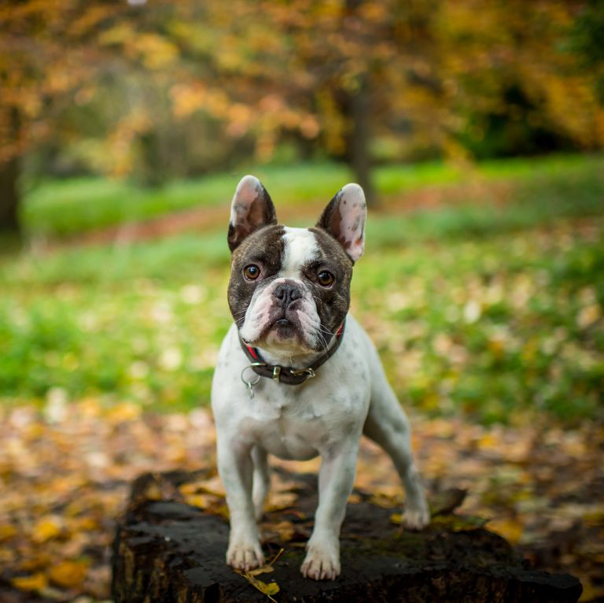
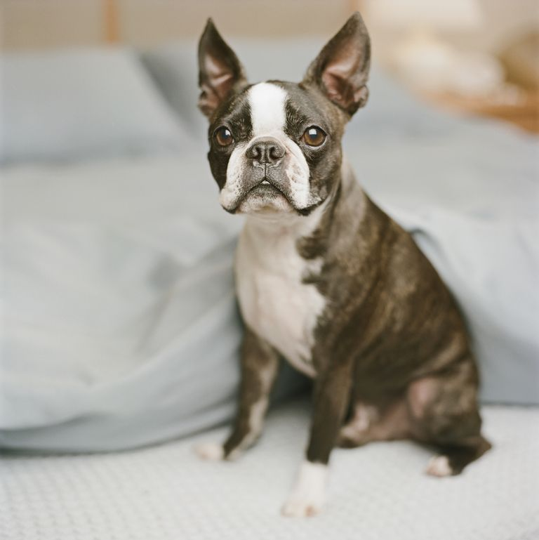
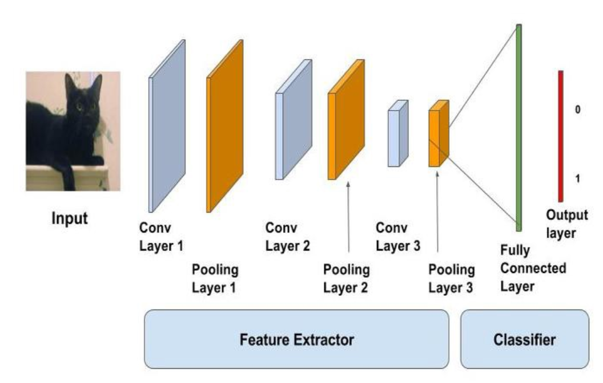

# Machine Learning Engineer Nanodegree

## Capstone Project

Ammar Altahhan  
March 10th, 2021

## I. Definition

### Project Overview

Imagine yourself walking in the park, where everyone are walking their cute dogs. There are more than 300 recognized dog breeds in the world (according to The World Canine Organization [FCI](https://www.psychologytoday.com/us/blog/canine-corner/201305/how-many-breeds-dogs-are-there-in-the-world)).

An average dog person would be able to identify around 10 dog breeds. This makes the idea of having a machine learning model capable of identifying dog breeds very appealing, and it was the case for many scientists. 

The dog breed classification problem have been experimented a lot, but no perfect solution was found. Basically, because it can be sometimes even hard for a human to identify two very similar dog breeds (just take a look at the following French Bulldog and Boston Terrier for example, and try to identify which is which)

 

This is known as a classification (or identification) problem. 
Thankfully, technical solutions aren't that far from solving this, using deep learning and artificial neural networks will provide us with an variety of tools to address this sort of problems.

The data for this project is provided by Udacity. It contains 13233 human images and 8351 dog images. The dog images dataset is separated into three groups, training dataset, validation dataset, and testing dataset. Every group of those datasets is further categorized into 133 different dog breeds classes.

### Problem Statement

The problem we're trying to solve here falls under a class of problems called Classifiers. A Machine Learning Classifier is an algorithm that categorizes data into one or more set of classes using automatic ordering. One of the popular examples of such classifiers is the email scanner, which scans received emails and labels them as spam or not spam emails. In our case, we're trying to address the classification of a dog's breed using a machine learning classifier.

This project aims to develop a model using concepts of deep learning, that can classify dog breeds with an accuracy of 60% at the least. This model will be part of a final software that can accept any image from the user as an input, if a dog is detected in this image, the software will use the model to identify which dog breed class looks most similar to the provided image (from a set of dog breeds the model was trained on). If the input image contained a human face image, the software will use the model to provide a prediction of the most similar dog breed to that human.

A number of steps will be followed in order to achieve this:

- Step 0: Importing Datasets
- Step 1: Detecting Humans
- Step 2: Detecting Dogs
- Step 3: Creating a CNN to Classify Dog Breeds (from - Scratch)
- Step 4: Using a CNN to Classify Dog Breeds (using Transfer - Learning)
- Step 5: Creating a CNN to Classify Dog Breeds (using - Transfer Learning)
- Step 6: Writing the Algorithm
- Step 7: Testing the Algorithm

### Metrics

For the dog/human face detection, the developed algorithm should return a high percentage of identifying dog/human images:

| Input\Algorithm   | Is human face?    | Is dog? |
| -------------     | :---:             | :---: |
| Human Face image  | >80%              | <20% |
| Dog image         | <20%              | >80% |

As for the dog breed class identification, since the data provided for the dog breed classes is balanced (as explained next), we'll use the accuracy as a metric of evaluation for this model. A minimum of 10% accuracy is required for the first phase (CNN from scratch), and a minimum of 60% for the second phase (CNN using transfer learning).

## II. Analysis

### Data Exploration

The dataset we're working with is divided into two groups, pictures of humans and pictures of dogs. The human images are provided for 5749 people, with multiple images per person. Dog images are divided again into training, validation and testing datasets.

In the dog images datasets, we have labelled images for 133 dog breeds. We have got 50 images / dog breed on average. The coefficient of standard deviation for number of images per dog breed is calculated to be 0.23, which indicates to an extent that the data is fairly distributed among all dog breeds classes.

All images are in the format of jpg and in RGB color format. Images have different sizes and resolutions, and for this, we will apply transformations to make sure that data are unified in format. We will resize and crop the images to a unified size. Also, random horizontal flipping and random rotation of up to 5 degrees are applied to the training data to perform some data augmentation in order to try and maximize the size of the training dataset of dog images.

There is no outstanding outliers or major abnormalities in the dataset. Dataset provided is mostly accurate and providing high quality images for all dog breeds and humans.

We're not defining features for the images of the dataset ourselves, since the project we're doing here uses a CNN (Convolutional Neural Network) model, to predict dog breed classes of provided dog breeds images. This model will be trained in a supervised deep learning environment and with labelled data. CNN will take in training mode a 2D image and its class as an input, and will return trained weights as an output, which are essentially data patterns or rules extracted from the images.

We will discuss next how this is done and what's the architecture followed by the model to achieve this result.

### Exploratory Visualization

No visualization can be given here.

### Algorithms and Techniques

First of all, in order to achieve the final result of having one software application classifying and recognizing dog breeds given both dog images and human images at the same time, we'll have to develop an algorithm that can identify human faces, and then develop a model that can identify and classify dog breeds.

To start, and in order to detect human faces in images, we will use OpenCV's implementation of Haar feature-based cascade classifiers. This kind of models is usually trained with two kinds of images, positive and negative images. It's well known for its training speed and ability to detect and classify objects. Then, we will write a detector of faces, returning if there is a human face found in the image or not using OpenCV's implementation of Haar feature-based cascade classifiers.

For detecting dogs in an image, we will use a pretrained VGG-16 model. This is not the target for this project so we'll be using a ready made model to make things simpler for the final software application that will use it. This VGG-16 model has been trained on [ImageNet](http://www.image-net.org/), a very large and popular database for image classification and other vision tasks. This model is capable of identifying 1000 possible categories in ImageNet, and dogs appear in an uninterrupted sequence that follows the 151-268 of the dictionary keys found [here](https://gist.github.com/yrevar/942d3a0ac09ec9e5eb3a). We'll make use of this to check if the image object recognized has a class that falls in this range, then we can say that a dog has been detected in this image.

As for the actual dog breed classification, we will create a CNN classifier as mentioned before. The first step will be to create this model from scratch. The CNN models are developed using multiple layers where each layer applies filters or feature detectors to generate a feature map. Each layer will be followed by a max pooling layer to reduce the invariance by changing the input by a small amount, while keeping the output unchanged.

After multiple iterations of feature detection and pooling, all input will be flattened and used to predict the output of the dog breed class. Of course, add images sent for the model for training or testing will undergo preprocessing transformations as mentioned in the section Data Exploration.

Next step will be to utilize transfer learning to develop another CNN model that has a better accuracy, given that transfer learning will move the "basic knowledge" obtained from the first model followed by more training. Data used for this transfer learning model will be the same as the one from before, and the same transformations will be applied again. This is because the older model was already trained in a similar dataset (given data augmentation, it will be different each time), so the model should be performing much better this time.

Finally, we will develop the final algorithm, that contains both human and dog detectors algorithm, as well as the enhanced dog breed classifier. This algorithm will check if a given image contains a dog, then it will try to predict its breed. If the image contained a human face, then it'll try to find the closest dog breed similar to the human face.

### Benchmark

In this section, you will need to provide a clearly defined benchmark result or threshold for comparing across performances obtained by your solution. The reasoning behind the benchmark (in the case where it is not an established result) should be discussed. Questions to ask yourself when writing this section:
- _Has some result or value been provided that acts as a benchmark for measuring performance?_
- _Is it clear how this result or value was obtained (whether by data or by hypothesis)?_

We will be using test loss and test accuracy as the benchmark of how the model is performing over different improvements. The improvements and important points at which the benchmark is really important would be to compare the CNN model created from scratch vs the CNN model created using transfer learning, and how much better performance did we get the second time.

For the test loss function, since we're dealing with a multi-class classification problem, we will use the cross entropy loss function.

Looking at the following table showing a comparison between benchmarking metrics for both models, we can see that we got a much better results when using the transfer learning with the CNN model:

| Model | Test Loss | Test Accuracy |
| :-------------: | :---: | :---: |
| CNN (from scratch)  | 3.40 | 19% |
| CNN (using transfer learning) | 0.48 | 87% |

## III. Methodology

### Data Preprocessing

Since the dataset we're starting with have different characteristics for the images, preprocessing images is needed here to make sure that all images sent as input to the model are having the same size at least. Here we document the transformations used on the dataset used for both models (CNN from scratch and CNN using transfer learning):

#### Training Dataset

- Resizing images to 256
- Randomly resizing and cropping to the minimum accepted image size 224
- Randomly flipping images horizontally
- Randomly rotating the images by a max of 5 degrees

#### Validation Dataset

- Resizing images to 256
- Center cropping to the minimum accepted image size 224

#### Testing Dataset

- Resizing images to 256
- Center cropping to the minimum accepted image size 224

### Implementation

Refer to section Algorithms and Techniques.

### Refinement

In the process of creating a deep learning based model to classify dog breeds based on their images. The first model created wasn't performing in an acceptable way (test accuracy was too low around 19%).

Performance was drastically improved when another iteration of the classification model was developed using transfer learning from the first one. Even though we used a very similar dataset on the second model, test accuracy has jumped to 87%, showing an improvement by more than 350% from the first model.

## IV. Results

### Model Evaluation and Validation

The model we had at hand by the end of this project was decent enough for the problem we were trying to solve, which is the ability to classify dog breeds. The final algorithm was able to do so, as well as giving the most resembling dog breed when given a human face as an input.

Upon testing the model with new data that it hasn’t seen, the final developed model for dog breeds classification achieved an accuracy of 87%. This accuracy is very acceptable given the size of input and the number of iterations we had the model train on.

The model can be really useful in its current state as part of a software for dog breeds classification. With an accuracy of 87%, it cannot be trusteed in serious application, but nevertheless, there are still much room for improvement (will be discussed later on).

### Justification

Compared to the VGG-16 model, our CNN model doesn’t perform as good, even after using transfer learning on the second iteration. However, given the difference in time of training (VGG-16 was trained for weeks and was using NVIDIA Titan Black GPU’s), and the difference in training dataset size, our model has performed well and it has much room for improvements.

Also, when we look at Table 2 from the Benchmark section, we can see that we got a big improvement on our second model (CNN using transfer learning) when compared to the first one (CNN from scratch). Though the final solution isn’t significant enough and as mentioned before, can be improved.

## V. Conclusion

### Free-Form Visualization

One of the most important aspects about this project is how the CNN models works on extracting features using multiple hidden layers. Each hidden layer will generate the feature maps (or activation maps), which will help in identifying different features present in an image like edges, horizontal and vertical lines, etc.. 

This diagram shows a very similar architecture of the one used in this project:

### Reflection

In this project, we have gone though a fun journey to develop an algorithm for identifying and classifying dog breeds. First of all, we looked at an instance implementation of the Haar feature-based cascade classifier to be able to reuse a pre-trained model for human face detection in images.

Then, we went on and did a similar thing for detecting dogs in images, but this time we used the VGG-16 model, a pre-trained model that can classify 1000 objects based on more than 14 million images from ImageNet.

After that, we started developing the actual model for dog breeds classification. We used CNN as the architecture that we want to follow. Using 3 convolutional layers mixed with pooling and then using fully connected layer to flatten the features and get out one output for the dog breed, we had a model with 19% accuracy that was developed from scratch.

Of course, this accuracy wasn’t enough, so we went ahead and looked into creating another iteration of this CNN model using transfer learning. By freezing the parameters and features obtained from the older model, and only replacing the fully connected layer, we were able to achieve a 87% accuracy. This was very interesting to see, because the second model was just as if it was using the basic knowledge obtained by the first model, to learn more advanced and complex mechanics for dog breeds classification.

Finally, after the model development, here comes the part where the final algorithm is developed, merging the three models (Haar, VGG-16 and our CNN model) into one algorithm that can take an image as an input , and returns a dog breed class for the dog if it was detected in the image, or a dog breed that is most resembling if a human was detected.

One difficult aspect while working with this project was the development of the first CNN model from scratch and figuring out the right transformations to use. However, it was a fun experience and the outcome was better than expected.

### Improvement

As mentioned before, this model can be improved in many ways, here I summarize a few that I’m most passionate about:

- Adding more dog images for other dog breeds to be able to classify all known dog breeds (current model only recognizes 133, less than half of the known dog breeds currently)

- Improving the result of when a human detected by predicting multiple similar dog breeds (maybe showing sample pictures of those breeds)

- Improving the performance and accuracy of the breed classifier model by adding more epochs or using a different model maybe

- Detecting multiple faces in an image (or maybe a human and a dog in the same image and provide similarity score)
